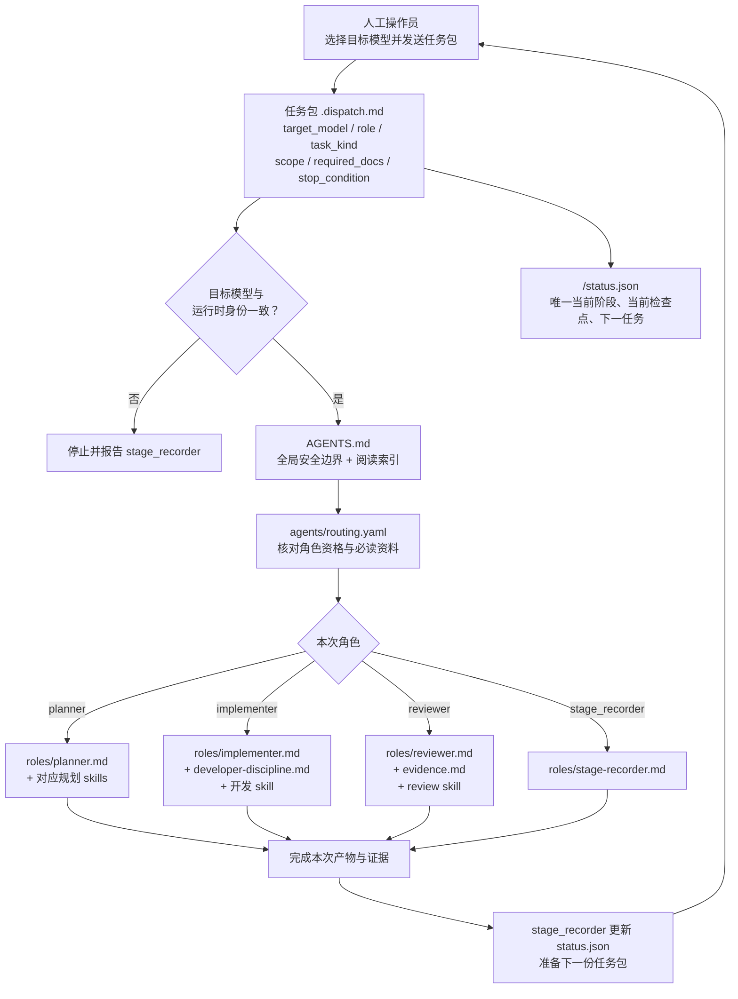

# Harness v2 重构设计草案

状态：DRAFT（等待用户讨论和批准；不是当前项目的生效规则）
范围：重建 Harness 的模型角色路由、按需阅读、阶段进度定位与最小门禁。
基线：保留 v1 已验证的安全内核；不保留 v1 的运行时语义适配。

## 1. 要解决的问题

当前 Harness 将模型路由、角色职责、任务流程、CLI 命令、审计回执、历史兼容和阶段进度同时写进 `AGENTS.md`、workflow YAML、registry、平行模式文档和 validator。它带来四个直接问题：

1. 模型收到任务后没有一个短而确定的路径来确认“我是谁、这次担任什么角色、必须读哪些资料”。
2. `stage-delivery.yaml` 看似是可执行工作流，但 validator 并不完整解析它；实际门禁与文档描述会漂移。
3. `ACTIVE.json`、`status.json`、`70-handoff.md`、dispatch 文件和 Git HEAD 都会表达进度，容易互相过时。
4. 同一条规则被多处重述；修改时需要同步多个文件，且历史兼容逻辑持续污染新阶段。

## 2. v2 的目标与非目标

### 目标

- 让每个被人工启动的模型在一个任务包内明确知道目标模型、角色、任务类型、允许范围、必读文件和停止条件。
- 将角色语义与具体模型分开：角色定义稳定，模型分配可替换。
- 将人类/模型可读的解释写入 Markdown；只将机器必须判断的路由和状态留在小型 YAML/Schema。
- 用一个当前状态文件定位阶段进展，并区分“被审代码快照”和“当前记录提交”。
- 保留 Git、测试、人工授权、独立终审、原始证据等安全内核。

### 非目标

- 不让模型自动启动、转派或调用另一个模型。
- 不迁移或重写任何 v1 阶段；v1 仅在归档 Git 提交/分支中用于审计。
- 不把模型自报身份当作可信权限来源；任务包和人工启动记录才是权威。
- 不在 v2 默认启用并行开发、嵌入预审或授权例外。

## 3. 核心决定

### 3.1 角色优先，模型可替换

v2 的最小角色集：

| 角色 | 作用 | 能否写产品代码 |
| --- | --- | --- |
| `human_operator`（人工操作员） | 授权、选择并启动目标模型、确认合并/实盘动作 | 由用户决定，不由 Harness 指派 |
| `planner`（规划者） | 澄清范围、设计、拆分、验收条件 | 否 |
| `implementer`（实现者） | 在边界内实现并自测 | 是 |
| `reviewer`（评审者） | 独立检查需求、diff、测试和证据 | 否 |
| `stage_recorder`（阶段记录器） | 更新阶段状态、保存证据引用、准备下一任务包 | 否，除非用户明确授权兼任 |

模型只是角色的候选人。默认策略可以把 Claude-GLM 配到后端实现、Kimi 配到前端实现、Codex/Claude 配到规划或评审，但这些默认值不改变角色合同。

### 3.2 一条规则只保留一个权威来源

| 内容 | 唯一权威 | 其他文件如何引用 |
| --- | --- | --- |
| 所有角色都必须遵守的安全边界 | `AGENTS.md` | 角色文档只链接，不复述 |
| 模型可担任的角色、任务类型与必读资料 | `agents/routing.yaml` | 任务包引用解析结果 |
| 角色职责、方法与示例 | `docs/harness/roles/*.md` | 路由 YAML 指向文件路径 |
| 特定工作方法/skill | `agents/skills/*.md` 与 `agents/developer-discipline.md` | 角色文档说明何时读取 |
| 当前阶段进度 | `<stage>/status.json` | `ACTIVE.json` 只保存 stage id |
| 机器门禁 | 状态 Schema + validator | Markdown 解释原因，不复制判断条件 |
| 默认流程说明 | `docs/harness/workflow.md` | 不再假装是运行时引擎 |

### 3.3 Karpathy 开发纪律的定位

现有 `agents/developer-discipline.md` 是从 `multica-ai/andrej-karpathy-skills` 的 `CLAUDE.md` 适配而来。v2 将其明确纳入 `implementer` 与 `fix` 任务的必读资料，而不是仅作为 workflow 中一条容易遗漏的 `reads` 记录。

它适用于任何获准写代码的模型，不只适用于 Claude：Claude-GLM、Kimi、Grok 或未来新增模型均须遵守。

## 4. 目标文件结构

```text
AGENTS.md                                  # 约 120–180 行：全局安全规则 + 按需阅读索引
agents/
  routing.yaml                             # 小型机器可读的 模型—角色—任务—必读资料 路由
  developer-discipline.md                  # Karpathy 适配版开发纪律
  skills/                                  # 具体方法技能；每份只服务一个工作方法
docs/harness/
  workflow.md                              # 默认线性流程与升级条件
  roles/
    planner.md                             # 设计、拆分、验收条件
    implementer.md                         # 开发边界、自测、停止交接
    reviewer.md                            # 独立审查、证据与 verdict
    stage-recorder.md                      # 状态、证据引用、任务包准备
  evidence.md                              # Git、测试、评审、人工授权
  model-adapters.md                        # 本机 CLI 使用和可用性检查
schemas/
  harness-v2-status.schema.json            # 当前状态的机器约束
scripts/
  validate-harness-v2.py                   # 只执行明确的 v2 门禁
reports/agent-runs/
  ACTIVE.json                              # 仅 {"active": "<stage-id>" | null}
  <stage-id>/
    status.json                            # 唯一当前状态
    <task>.dispatch.md                     # 一次模型任务的权威任务包
    evidence/                              # 原始输出、测试日志、review 结论
    handoff.md                             # 可选叙述；不得重复状态字段
```

## 5. 轻量路由 YAML

`agents/routing.yaml` 仅保存模型资格与必读资料，禁止放入长段规则、命令模板、历史兼容和阶段叙事。

```yaml
version: 2

roles:
  planner:
    task_kinds: [design, breakdown]
    mode: read_write_docs
    required_docs:
      - AGENTS.md
      - docs/harness/roles/planner.md
    skills: [product_strategist, software_architect, task_planner]

  implementer:
    task_kinds: [implementation, fix]
    mode: write_code
    required_docs:
      - AGENTS.md
      - docs/harness/roles/implementer.md
      - agents/developer-discipline.md
    skills: [senior_developer, minimal_change_engineer]

  reviewer:
    task_kinds: [review]
    mode: read_only
    required_docs:
      - AGENTS.md
      - docs/harness/roles/reviewer.md
      - docs/harness/evidence.md
    skills: [code_reviewer, reality_checker]

  stage_recorder:
    task_kinds: [stage_update]
    mode: read_write_docs
    required_docs:
      - AGENTS.md
      - docs/harness/roles/stage-recorder.md

models:
  claude_glm:
    eligible_roles: [implementer, stage_recorder]
  kimi:
    eligible_roles: [implementer]
  codex:
    eligible_roles: [planner, reviewer, stage_recorder]
  claude:
    eligible_roles: [planner, reviewer, stage_recorder]
  grok:
    eligible_roles: [planner, implementer]
    requires_user_enablement_for: [implementer]
```

最终的模型选择由当前阶段任务包记录。模型启动时只确认“运行时模型与任务包 target_model 是否一致”；不一致即停止并报告。

## 6. 模型启动与文件引用流程图



此图的关键是：任务包给出本次实例的角色；路由 YAML 验证模型是否有资格担任该角色并列出必读资料；角色 Markdown 给出具体方法；状态文件给出唯一进度。模型不会自行转派下一个模型。

## 7. 统一的阶段进度模型

### 7.1 仅保留一个当前状态来源

`ACTIVE.json` 只用于定位活动阶段：

```json
{"active": "2026-07-example-v2"}
```

`status.json` 是唯一的动态进度来源；下例采用 JSON，是否采用该格式仍由第 10 节的用户决定：

```json
{
  "stage_id": "2026-07-example-v2",
  "phase": "review",
  "checkpoint": "review_round_1_dispatched",
  "next": {
    "owner": "human_operator",
    "role": "reviewer",
    "dispatch": "review-r1.dispatch.md"
  },
  "delivery_sha": "...",
  "ledger_sha": "..."
}
```

`delivery_sha` 是正在被测试或评审的代码快照；`ledger_sha` 是当前阶段记录与派发的最新提交。

`handoff.md` 可以记录风险、已决定事项和恢复说明，但不得再写 `phase`、`next_action`、`head`、`rework_count` 等动态状态字段。它不是第二个状态机。

### 7.2 默认流程

```text
用户授权/范围确认 → 规划与拆分 → 实现与自测 → 阶段记录与验证 → 独立评审 → 用户验收
```

方向面板、并行实现、嵌入预审、授权例外均为显式扩展。它们未启用时既不要求阅读对应文档，也不产生对应证据文件。

## 8. 必保留的硬门禁

1. 产品语义、凭据、实盘副作用、风险阈值、合并主分支必须由用户授权。
2. 评审者不得是被审代码的实现/修复作者；终审应与代码作者保持供应商隔离。
3. 进入正式评审前必须有已提交的代码差异、测试结果和原始实施证据。
4. 评审结论必须可解析、可追溯，并引用被审的代码快照。
5. 模型不得自行启动、转派或冒充另一个模型会话；人工操作员启动目标会话。

其余规则若不能明确降低上述风险，默认不进入全局门禁。

## 9. 实施拆分与验收

### 步骤 A：定义 v2 文档与角色合同

- 新建精简 `AGENTS.md`、四份角色文档、`workflow.md`、`evidence.md`。
- 将当前 `agents/developer-discipline.md` 保留为实现/修复角色的必读资料。
- 验收：一个模型只根据 `AGENTS.md` 与任务包即可定位需读文件，无须通读旧 workflow。

### 步骤 B：建立小型路由 YAML 与任务包模板

- 新建 `agents/routing.yaml` 和任务包模板。
- 任务包固定声明 target model、role、task kind、必读资料、边界、产物与停止条件。
- 验收：每个角色均能从 YAML 解析到唯一的角色文档与 skill 清单。

### 步骤 C：建立最小状态 Schema 与 validator

- 定义 `ACTIVE.json` 与 `status.json` 的字段边界。
- validator 只检查状态、角色资格、任务包引用、测试/评审证据和授权门；不解析 Markdown 叙述。
- 验收：活动阶段只有一个动态进度来源；`delivery_sha` 与 `ledger_sha` 不再混淆。

### 步骤 D：以一个无实盘副作用的样例阶段演练

- 用单一实现者和单一独立评审者走完默认线性流程。
- 记录读取量、需要人工填的字段和任何重复信息。
- 验收：无需并行扩展、Session ID 多处镜像或 v1 兼容字段即可完成审计。

### 步骤 E：用户批准后切换新阶段

- v1 阶段继续按 v1 完成或停止；不自动迁移。
- 新阶段只能使用 v2 文件结构与 validator。
- v1 保留在 Git 历史/归档引用中，不出现在 v2 默认阅读路径。

## 10. 待用户确认的决定

1. `stage_recorder` 是否允许由同一个规划模型兼任，还是必须独立会话？
2. 默认流程是否坚持两层评审，还是只保留一个独立终审并按风险增加专项评审？
3. 是否继续按“后端 GLM / 前端 Kimi / Codex 终审”设置默认模型，还是将模型选择全部交给每个阶段的人工任务包？
4. 并行模式是否作为未来插件保留，还是 v2 首版完全不实现？
5. `status.json` 是否使用 YAML 书写、JSON 书写，或以 JSON Schema 约束的 JSON 书写？

---

当前 Session ID: unavailable（本会话未暴露 provider-native Session ID）
Session ID 来源: unavailable
原始输出路径: reports/agent-runs/2026-07-harness-v2-rebuild-design/06-harness-v2-design.md
本地北京时间: 2026-07-29 00:44:17 CST
下一步模型: human
下一步任务: 审阅本草案的五项待确认决定，并冻结 v2 的最小角色集与默认评审拓扑。
