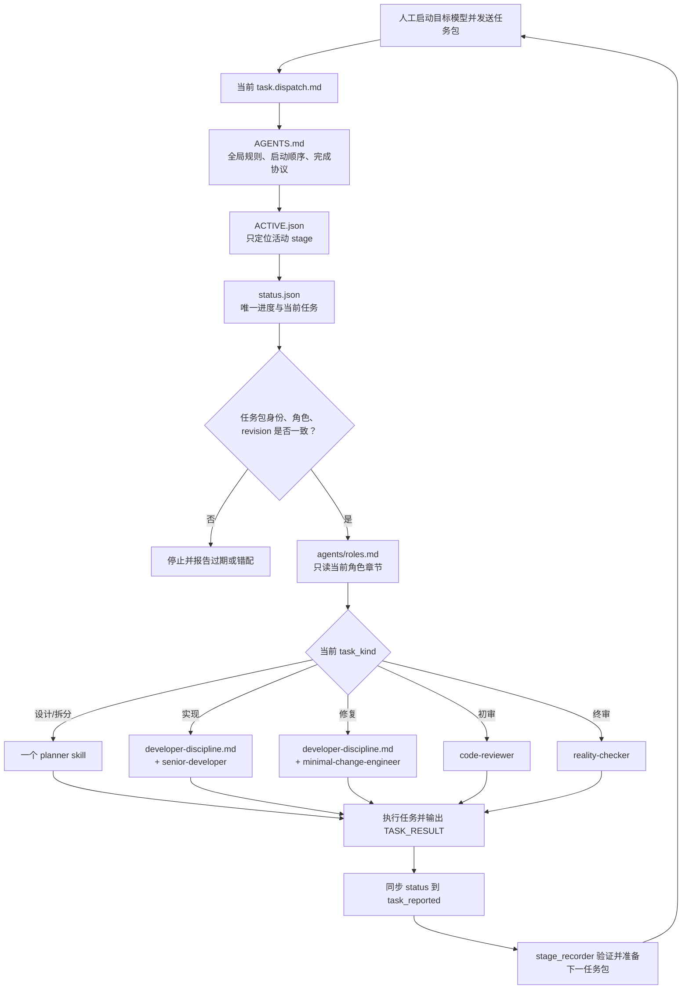

# Harness v2 极简渐进式披露设计

状态：DRAFT-2（供用户与其他模型独立评审；尚未成为项目规则）
设计中心：以 `AGENTS.md` 为唯一启动入口，用极少量 Markdown 按角色渐进式披露；用一个 `status.json` 表达当前进展。
本地北京时间：2026-07-29 12:33:22 CST

## 0. 一页结论

Harness v2 首版不建设新的工作流平台，也不增加一组新的规范目录。

只保留：

```text
AGENTS.md
agents/roles.md
agents/developer-discipline.md
agents/skills/*.md
reports/agent-runs/ACTIVE.json
reports/agent-runs/<active-stage>/status.json
reports/agent-runs/<active-stage>/<task>.dispatch.md
reports/agent-runs/<active-stage>/evidence/*
```

模型的工作路径只有一条：

```text
任务包确认模型身份与角色
→ 读取 AGENTS.md
→ 读取 ACTIVE.json 和活动阶段 status.json
→ 读取 agents/roles.md 的当前角色章节
→ 只读取任务包点名的一个 skill
→ 执行任务
→ 输出固定 TASK_RESULT
→ 同步 status.json
→ 停止，等待人工启动下一个模型
```

`stage-delivery.yaml`、长 registry、第二套 handoff 状态、默认历史扫描、Session ID 多处镜像和 v1 兼容分支都不进入 v2 默认运行面。

## 1. 设计目标

1. 新终端能在 4–8K tokens 内定位当前项目进度和自身角色。
2. 进入具体任务后的 Harness 上下文控制在 8–15K tokens。
3. 当前项目状态只改一个地方，消除 `ACTIVE`、`status`、`handoff`、dispatch 和 Git 提交信息互相冲突。
4. 模型职责和模型名称分离，但模型默认分配集中在一个人类可读文件。
5. 每次模型执行结束后都形成一次进度同步；全新会话不依赖旧 transcript。
6. 已完结 stage 完全退出初始化、搜索和默认校验路径。

## 2. 不可妥协的安全内核

以下规则直接保留在 `AGENTS.md`，不下沉到其他文档：

1. 产品语义、凭据、实盘副作用、风险阈值、破坏性动作、部署和合并主分支必须由用户授权。
2. 实现者只能修改任务包允许的文件；不得覆盖用户或其他终端的工作。
3. 评审者不得是被审代码的实现或修复作者；评审期间不得修改产品代码。
4. 正式验收必须基于已提交的 diff、测试结果和可定位的原始证据。
5. 模型不得启动、转派或冒充另一个模型；下一个模型由人工操作员启动。

其他规则若不能直接降低上述风险，不进入全局硬门禁。

## 3. 最小文件结构与职责

| 文件 | 是否默认读取 | 唯一职责 |
| --- | --- | --- |
| `AGENTS.md` | 是 | 全局安全边界、初始化顺序、角色阅读导航、任务结束同步协议 |
| `agents/roles.md` | 按角色读取一个章节 | 所有角色职责、当前默认模型分配、输入输出和禁止事项 |
| `agents/developer-discipline.md` | 仅实现/修复 | Karpathy 风格的简洁开发纪律 |
| `agents/skills/*.md` | 任务包点名时读取一个 | 设计、开发、修复、初审或终审的具体方法 |
| `ACTIVE.json` | 是 | 只保存当前活动 stage id 或 `null` |
| `<stage>/status.json` | 有活动 stage 时读取 | 唯一动态进度、当前任务、下一动作、两个 Git 锚点 |
| `<task>.dispatch.md` | 当前任务读取 | 目标模型、角色、范围、输入、skill、产物、结束条件 |
| `<stage>/evidence/*` | 被任务或评审点名时读取 | 原始输出、测试日志和评审结论 |
| `docs/model-adapters.md` | 仅启动/排障时 | 现有本地 CLI 命令和可用性说明；不进入普通模型上下文 |

不新建 `workflow.md`、`evidence.md`、`task-completion.md`、四份独立角色文档或新的 routing YAML。

## 4. `AGENTS.md` 的目标结构

目标长度：120–180 行。

```text
1. Purpose
2. Startup
3. Five Hard Rules
4. Role Reading Table
5. Active Stage And Status
6. Task Execution
7. Task Completion And Progress Sync
8. Human Gates
9. Historical Stage Isolation
```

### 4.1 Startup

`AGENTS.md` 只要求：

```text
1. 读取 ACTIVE.json。
2. active == null：停止 stage 恢复，不扫描历史目录。
3. active != null：读取对应 status.json。
4. 读取 status.current_task.dispatch 指向的任务包。
5. 按任务包 role 读取 roles.md 的一个章节。
6. 只读取任务包 required_skill 指向的 skill。
```

### 4.2 角色阅读导航

`AGENTS.md` 中只放一张表：

| role | 必读 |
| --- | --- |
| `planner` | `agents/roles.md#planner` + 任务指定的规划 skill |
| `implementer` | `agents/roles.md#implementer` + `developer-discipline.md` + 一个开发/修复 skill |
| `reviewer` | `agents/roles.md#reviewer` + 一个评审 skill |
| `stage_recorder` | `agents/roles.md#stage-recorder` |

不在 `AGENTS.md` 重写各角色细则。

## 5. `agents/roles.md` 的内容

所有角色集中在一个文件，避免一角一文件。

### 5.1 Planner（规划者）

- 默认候选：Codex、Claude。
- 任务：需求澄清、技术设计、任务拆分、验收条件。
- 可用 skill：
  - `product-strategist`
  - `software-architect`
  - `task-planner`
- 每个任务只读取任务包点名的 skill，不默认全部加载。
- 禁止写产品代码。

### 5.2 Implementer（实现者）

- 默认后端：Claude-GLM。
- 默认前端：Kimi。
- Grok：仅用户明确启用时。
- 必读 `agents/developer-discipline.md`。
- 实现任务读取 `senior-developer`；修复任务读取 `minimal-change-engineer`，不同时加载。
- 在任务边界内实现、自测、报告。
- 不决定或启动下一模型。

### 5.3 Reviewer（评审者）

- 候选：Codex、Claude，或满足供应商隔离的交叉评审模型。
- 初审读取 `code-reviewer`。
- 终审读取 `reality-checker`。
- 高风险任务可由用户增加 `security-reviewer`，但不是默认必读。
- 不得与实现/修复作者共享供应商身份。
- 不修改产品代码。

### 5.4 Stage Recorder（阶段记录器）

- 可以由规划模型兼任，也可以由独立会话承担；是否强制独立由用户最终决定。
- 维护唯一的 `status.json`。
- 验证模型结果、证据路径和 Git 状态。
- 准备下一任务包，但不启动目标模型。
- 不拥有最终产品验收权。

## 6. 任务包设计

任务包是一次模型执行的唯一任务权威。使用普通 Markdown 加简短 YAML front matter，不需要额外 schema。

```markdown
---
task_id: backend-implementation
target_model: claude_glm
role: implementer
task_kind: implementation
required_role_section: agents/roles.md#implementer
required_skill: agents/skills/senior-developer.md
status_revision: 7
---

# 目标

完成订单详情持久化。

## 范围

- allowed: backend/service.py
- allowed: backend/store.py
- forbidden: frontend/**

## 输入

- 00-task.md#T3
- 10-design.md#Persistence

## 验收

- 指定测试通过；
- 生成实施报告；
- 按 AGENTS.md 的 Task Completion 协议同步进度；
- 停止，不启动下一模型。
```

模型启动后核对：

```text
运行时模型 == target_model
当前角色允许执行 task_kind
status.revision == status_revision
```

任一不符即停止并报告，避免过期任务包覆盖新进展。

## 7. 项目进度与上下文恢复

### 7.1 ACTIVE 只做指针

```json
{"active": "2026-07-example-v2"}
```

或：

```json
{"active": null}
```

不保存 `last_completed`、长篇 `note`、风险描述或下一任务。

### 7.2 status 是唯一动态状态

```json
{
  "schema_version": 2,
  "revision": 8,
  "stage_id": "2026-07-example-v2",
  "phase": "implementation",
  "checkpoint": "task_dispatched",
  "current_task": {
    "id": "backend-implementation",
    "status": "dispatched",
    "target_model": "claude_glm",
    "role": "implementer",
    "dispatch": "backend-implementation.dispatch.md",
    "result": null
  },
  "next": {
    "owner": "claude_glm",
    "action": "execute_current_task"
  },
  "delivery_sha": "abc123",
  "ledger_sha": "def456",
  "blockers": []
}
```

- `revision`：防止旧任务覆盖新状态。
- `delivery_sha`：当前被实现、测试或评审的代码快照。
- `ledger_sha`：包含最新阶段状态和派发记录的提交。
- `current_task`：当前唯一任务。
- `next`：唯一下一动作。

不再从 `70-handoff.md`、dispatch receipt、review 文案或 Git subject 推断当前状态。

## 8. 模型执行结束后的进度同步

### 8.1 每个任务必须输出固定结果块

任务结束时模型输出：

```text
[TASK_RESULT v2]
task_id: backend-implementation
outcome: completed | blocked | failed
summary: <一句话>
artifacts: <逗号分隔路径>
checks: <测试/检查摘要>
blockers: <none 或具体内容>
[/TASK_RESULT]
```

该格式直接写在 `AGENTS.md`，任务包只引用，不复制。

### 8.2 谁更新 status

首版不依赖 Hook，也不建设新的状态同步服务。

- 允许写阶段元数据的实现/规划模型：按固定协议将自己的任务标为 `reported`，不得推进到下一业务阶段。
- 只读 reviewer：只输出 `TASK_RESULT`；宿主或 stage recorder 将结果同步到 status，避免 reviewer 修改自身门禁状态。
- stage recorder：核对结果与产物后，更新到 `verified` 并准备下一任务包。

模型可执行的最大状态变化：

```text
dispatched/running → reported
```

模型不得自行执行：

```text
reported → verified
verified → review/accepted
```

状态同步后：

```json
{
  "revision": 9,
  "phase": "implementation",
  "checkpoint": "task_reported",
  "current_task": {
    "id": "backend-implementation",
    "status": "reported",
    "result": "evidence/backend-implementation-result.md"
  },
  "next": {
    "owner": "stage_recorder",
    "action": "verify_current_task"
  }
}
```

### 8.3 Hook 的定位

Hook 是后续可选优化，不是 v2 首版依赖：

- 可捕获只读 reviewer 的最终 `TASK_RESULT`；
- 可在异常结束时标记 `interrupted`；
- 不得自行判断任务通过或选择下一模型；
- 不为每个模型维护一套仓库内 Hook 文档。

只有实际演练证明手工/模型同步容易遗漏时，才实现一个通用 Hook 或小型同步命令。

## 9. 模型与文件引用流程图



## 10. 默认 stage 流程

流程直接写在 `AGENTS.md`，不再维护 800 行 workflow YAML：

```text
用户确认范围
→ planner 设计/拆分
→ implementer 实现与自测
→ stage_recorder 验证
→ 独立 reviewer 评审
→ 用户验收
```

设计原则：

- 默认只保留一次独立终审；
- 高风险任务可由用户增加初审、安全评审或第二终审；
- 并行实现不是首版能力；
- 方向面板不是默认流程，只在用户明确要求时运行；
- 返工回到 implementer，再经过验证和独立评审。

“默认一次终审”仍是待用户确认的设计选择，不在草案阶段强制生效。

## 11. 完结 stage 的完全隔离

阶段被用户验收后：

1. 将长期有效决定提升到产品、架构或规划文档。
2. 用 Git tag 或归档分支固定完整 stage 证据。
3. 从当前工作树移除该 stage 运行目录。
4. 将 `ACTIVE.json` 设为 `{"active": null}`。
5. 新终端不得扫描已完成 stage。

需要审计旧 stage 时，在单独 worktree 中打开对应归档引用。

v2 当前工作树不维护完整完成阶段索引；Git tag 就是索引，避免再增加一份可能过期的完成清单。

## 12. v1 组件的处置

| v1 组件 | v2 首版处理 |
| --- | --- |
| 600+ 行 `AGENTS.md` | 重写为 120–180 行 |
| `stage-delivery.yaml` | 退出默认运行面，保留在 v1 Git 归档 |
| `agents/registry.yaml` | 模型/角色说明收敛到 `agents/roles.md`；不新建 routing YAML |
| `70-handoff.md` Recovery Header | 删除动态状态职责；必要叙述进入任务证据 |
| `ACTIVE.json` 长 note | 删除，只保留 active 指针 |
| 90KB 级 `status.json` | 压缩为当前状态和当前任务 |
| Session ID 多处镜像 | 不作为默认进度协议 |
| 并行 R1–R12 | 不进入 v2 首版 |
| authorized exceptions | 不进入 v2 首版 |
| 全历史 validator | 默认只检查活动 stage |
| `docs/model-adapters.md` | 保留为人工启动/排障的按需参考 |

## 13. 实施顺序

### 阶段 A：冻结设计

- 用户与其他模型评审本稿。
- 决定角色集合、默认评审次数、stage recorder 是否独立。
- 不改当前项目业务代码或 v1 活动 stage。

### 阶段 B：只改文档入口

- 重写 `AGENTS.md`。
- 新建单一 `agents/roles.md`。
- 清理现有 skill 的重复前言，但不重写其核心方法。

### 阶段 C：建立最小运行状态

- 精简 `ACTIVE.json` 模板。
- 精简 `status.json` 模板和任务包模板。
- 先不用 Hook、不写新工作流引擎。

### 阶段 D：无实盘样例演练

- 用一个小型非业务风险任务依次跑 planner、implementer、reviewer。
- 验证新终端上下文、TASK_RESULT 同步和历史隔离。
- 记录实际遗漏，再决定是否需要一个同步脚本或 Hook。

### 阶段 E：用户批准切换

- 新 stage 使用 v2。
- 已在进行的 v1 stage 按 v1 完成或停止，不做运行时兼容。
- v1 进入 Git 冷归档，不出现在 v2 默认阅读路径。

## 14. 验收标准

1. `AGENTS.md` 不超过 180 行。
2. 无活动 stage 时，仓库初始化上下文不超过 8K tokens。
3. 进入普通任务后，Harness 相关上下文不超过 15K tokens。
4. 一个新终端能从 `ACTIVE → status → dispatch → role → skill` 唯一恢复。
5. 项目动态进度只存在于一个 `status.json`。
6. 任何任务完成后都有 `TASK_RESULT`，并使 status 进入 `task_reported`。
7. 完结 stage 不存在于当前工作树的默认运行目录。
8. reviewer 与实现/修复作者保持身份隔离。
9. 无模型能自行启动下一模型或自行宣布用户验收。
10. v2 validator（若后续需要）不含 v1 兼容分支。

## 15. 请其他模型重点评审的问题

1. 仅靠 `AGENTS.md + roles.md + task packet + status.json` 是否足以稳定恢复上下文？
2. 模型允许把任务状态更新到 `reported`，是否会产生不可接受的状态篡改风险？
3. reviewer 完全只读、由宿主或 stage recorder 同步结果，是否是合理边界？
4. 不使用 routing YAML 是否会失去必要的机器可验证性？
5. 默认一次独立终审是否足够；哪些风险等级必须增加初审或安全评审？
6. 以 Git tag/归档分支完全隔离完结 stage，是否满足审计和恢复要求？
7. 首版不实现 Hook，是否会让进度同步过度依赖模型纪律？
8. 是否还有可以删除但不会削弱安全内核的文件或角色？

## 16. 可直接复制给评审模型的请求

```text
请独立评审：
reports/agent-runs/2026-07-harness-v2-rebuild-design/07-harness-v2-minimal-design.md

目标不是评价文风，而是判断该设计能否被实现并长期保持精简。请重点检查：

1. AGENTS.md 作为唯一启动入口是否成立；
2. 模型身份、角色、skill 和任务包的引用链是否唯一；
3. status.json 作为唯一进度来源是否存在竞态或权限漏洞；
4. TASK_RESULT 与 reported/verified 两步状态是否足够可靠；
5. 完结 stage 冷归档是否会破坏必要审计；
6. 哪些设计仍然重复或过度；
7. 给出必须修改项、建议修改项和可接受的剩余风险。

不要启动其他模型，不要修改仓库，只返回独立评审意见。
```

---

当前 Session ID: unavailable（本会话未暴露 provider-native Session ID）
Session ID 来源: unavailable
原始输出路径: reports/agent-runs/2026-07-harness-v2-rebuild-design/07-harness-v2-minimal-design.md
本地北京时间: 2026-07-29 12:33:22 CST
下一步模型: human-selected independent reviewers
下一步任务: 独立评审本 DRAFT-2，并由用户决定是否冻结为实现基线。
