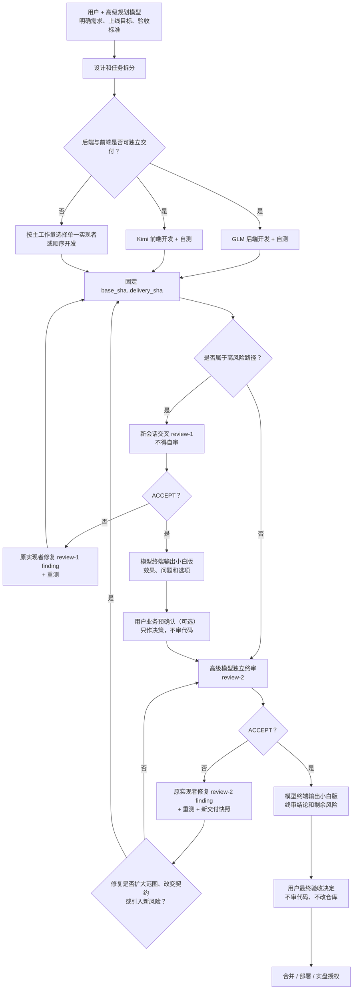

# Harness v2 极简渐进式披露设计（DRAFT-3.2）

状态：讨论稿，不代表已经切换 Harness
基线：DRAFT-2 + Fable5 两轮评审意见 + 用户补充原则
目标：在不牺牲资金安全、评审独立性和任务可恢复性的前提下，把 Harness 缩成一套容易理解、容易执行、容易维护的最小框架。

---

## 0. 一页结论

新版 Harness 继续以 `AGENTS.md` 为唯一启动入口，但不把所有细节塞回
`AGENTS.md`。它只保留：

1. 项目开发原则；
2. Harness 设计原则；
3. 七条不可妥协的安全规则；
4. 唯一启动顺序；
5. 角色和按需阅读入口；
6. 默认开发与评审流程；
7. 任务结束时的最小回报协议；
8. 完结 stage（阶段）的隔离规则。

其余信息只在任务需要时读取：

- 角色职责集中在一个 `agents/roles.md`；
- 开发纪律沿用一个 `agents/developer-discipline.md`；
- 具体能力约束按任务只读一个 `agents/skills/*.md`；
- 当前 stage 的事实只认一个 `status.json`；
- 跨 stage 仍然有效的实盘风险和待办，只认一个很小的
  `PROJECT_STATE.md`；
- 当前 stage 的任务要求由一个人工投递的 `*.dispatch.md` 提供；
- 历史 stage 默认不读，完成后从日常工作树移走。

工作流 YAML（YAML 流程文件）不再承担模型理解、角色教育和进度恢复三种职责。
复杂自动化真正需要机器执行时再增加；v2 首版不建立新的 routing YAML（路由
YAML）、结果 schema（结构定义）或 Hook（自动钩子）体系。

---

## 1. 两条最高设计原则

下面两段应直接进入新版 `AGENTS.md`，成为具体流程规则的上位原则。

### 1.1 项目开发原则：快速上线，按事实解决问题

建议写入：

> 项目开发以尽快交付可用版本、获得真实反馈为首要目标。只处理已经出现、
> 有证据支持、验收标准明确的问题，不为尚未发生且没有现实依据的假设场景
> 预先堆叠抽象层、兼容层或复杂防御。以后出现具体问题，再依据真实场景做
> 最小范围修复。

这条原则不是“忽略风险”，而是“拒绝凭空猜风险”：

- 已经存在的裸露仓位、资金风险、实盘开关和缺失平仓能力，必须处理；
- 已经观察到的模型错配、评审漏判和状态冲突，必须处理；
- 低成本的输入校验、错误提示和失败关闭仍然保留；
- 没有事实、没有样本、没有明确需求的未来兼容设计，不进入当前版本。

判断一句设计是否该做，只问三件事：

1. 这个问题现在真实存在吗？
2. 有日志、样本、用户需求或历史事故证明吗？
3. 不处理会阻止当前上线或带来明确风险吗？

如果三个问题都是“否”，就记录为未来观察项，不在当前实现中扩建框架。

### 1.2 Harness 原则：最小改动，渐进式披露

建议写入：

> Harness 框架以最小改动和渐进式披露为主。启动入口只保留所有模型都必须
> 知道的规则；角色、技能、任务和证据按当前动作逐层读取。新增规则优先修改
> 现有权威文件，只有在信息具有独立生命周期、独立责任人或必须默认读取时，
> 才新增文件。

新增任何 Harness 文件前，必须回答：

1. 为什么不能放进现有权威文件？
2. 谁负责更新它？
3. 哪个动作会读取它？
4. 它与现有状态会不会重复？
5. 删除它会失去什么不可替代的能力？

回答不清楚，就不新增。

---

## 2. 不可妥协的最小安全内核

“快速上线”和“最小改动”不能削掉以下七条：

1. 资金、下单、实盘开关、凭证、破坏性数据操作必须由用户明确授权。
2. 任何模型都不得启动、转派、调用或冒充另一个模型会话；下一个模型只能由
   人工操作员在对应终端启动。模型只能报告结果和建议下一步，不能自行派发。
3. 实现者只能修改任务包明确允许的文件，不得越界修改，也不得覆盖用户或其他
   终端正在进行的工作；发现范围不足时停止并报告。
4. 实现者不能评审自己写的代码；正式评审必须使用新的独立会话。
5. 评审隔离按模型供应商判断，不按 CLI（命令行工具）外壳判断。
6. 正式评审必须基于已提交的固定 `base_sha..delivery_sha` 区间，不能基于
   会移动的 `HEAD` 或未提交工作区。
7. 评审没有明确、结构完整的 `ACCEPT`（接受）结论，就一律视为未通过。

它们直接来自已经发生过的事故或确定的资金风险，不属于“猜测未来场景”。

---

## 3. v2 首版的最小文件结构

```text
AGENTS.md
PROJECT_STATE.md

agents/
├── roles.md
├── developer-discipline.md
└── skills/
    └── *.md

reports/agent-runs/
├── ACTIVE.json
└── <active-stage>/
    ├── status.json
    ├── <task>.dispatch.md
    └── evidence/
```

已有的 `docs/model-adapters.md` 暂时保留，但它只供人工启动模型或排查 CLI
问题时按需读取，不进入每个新终端的默认上下文。

v2 首版不新增：

- `workflow.md`；
- 新版 workflow/routing YAML；
- 多个分散的角色文档；
- `task-completion.md`；
- `evidence-rules.md`；
- 新的结果 schema 文件；
- Hook 设计文档；
- 兼容旧状态语义的适配层。

能用 `AGENTS.md` 中十几行规则说清的事情，不再单独建文档。

---

## 4. 每个文件只负责一件事

| 文件 | 唯一职责 | 默认读取 |
|---|---|---|
| `AGENTS.md` | 启动、硬规则、阅读导航、默认流程 | 是 |
| `PROJECT_STATE.md` | 跨 stage 仍然有效的实盘风险、未完待办和最近归档坐标 | 是，保持 1–2 KB |
| `agents/roles.md` | Planner、Implementer、Reviewer、Stage Recorder 的职责和模型映射 | 只读当前角色章节 |
| `agents/developer-discipline.md` | 实现和修复时共同遵守的开发纪律 | 只有实现/修复任务读取 |
| `agents/skills/*.md` | 当前任务的一项具体能力约束 | 每次最多读取任务点名的一个 |
| `ACTIVE.json` | 当前活跃 stage 的单一指针 | 是 |
| `<stage>/status.json` | 当前 stage 唯一动态状态 | 有活跃 stage 时读取 |
| `<task>.dispatch.md` | 当前任务的范围、输入、验收、角色和回报格式 | 人工投递后读取 |
| `evidence/*` | 原始测试、实现报告、评审结果和必要样本 | 只有任务或评审点名时读取 |

`ACTIVE.json` 不再保存自由文本说明，也不保存进度副本：

```json
{"active": "2026-07-example-v1"}
```

或：

```json
{"active": null}
```

---

## 5. 跨 stage 状态：增加一个小而固定的家

DRAFT-2 最大的缺口，是 stage 结束后把目录移走，却没有地方保存仍在持续的
运营事实。例如：

- Start gate（启动闸门）当前是否开启；
- 是否存在未平的实盘仓位；
- 当前系统是否缺少平仓能力；
- 尚未完成但必须带入下一阶段的 follow-up（后续任务）。

这些不是设计决定，也不是历史审计材料，不能随着 stage 目录一起冷藏。

因此新增唯一一个默认读取的小文件：`PROJECT_STATE.md`。

建议固定结构：

```md
# Project State

## Live Risks
- [OPEN] 风险事实、发现时间、证据路径、当前处置责任人

## Open Follow-ups
- [OPEN] 待办、来源 stage、建议进入的下一 stage

## Last Completed
- stage: <stage-id>
- archive: <git-tag-or-branch>
- completed_at: <time>
```

规则：

- 只记录仍然影响当前工作的事实，不写发展历史；
- 单腿成交、裸露仓位、实盘闸门变化等事故或风险一旦发生，经核实后立即写入，
  不得等到 stage 收尾；
- Stage Recorder 是 `PROJECT_STATE.md` 的正常写入者；实现和评审会话只在
  `TASK_RESULT` 中报告事实，不直接修改该文件；执行中发现实盘事故时应停止
  当前动作并立即回报，不得等原任务全部完成；
- 风险解除或待办迁移后立即删除或标记关闭；
- 每条内容必须有证据路径或来源 stage；
- `ACTIVE.json` 不重复保存 `last_completed` 和 `archive`；
- stage 收尾前必须把仍有效的风险和待办迁入这里；
- 文件超过约 2 KB，就说明没有及时收口，应清理而不是继续扩写。

这样既解决 `active: null` 时新终端失去方位的问题，又不恢复
`ACTIVE.json note` 的腐烂模式。

---

## 6. 唯一启动顺序

所有文档和流程图只保留下面一种顺序。

### 6.1 人工已经投递任务包

```text
AGENTS.md
  → 人工投递的 <task>.dispatch.md
  → ACTIVE.json
  → PROJECT_STATE.md
  → 当前 status.json
  → 核对 packet_revision 与 status.revision
  → roles.md 当前角色章节
  → 任务点名的一个 skill
  → 开始执行
```

人工投递的 task packet（任务包）是这次会话的入口，`status.json` 是核对它
是否仍然有效的权威状态。两者不一致时停止，不自行猜测。

### 6.2 没有收到任务包

```text
AGENTS.md
  → ACTIVE.json
  → PROJECT_STATE.md
  → 若存在 active，再读 status.json
  → 等待人工指派，不扫描历史目录
```

### 6.3 避免 revision（修订号）反复作废

Stage Recorder（阶段记录器）准备下一轮任务时：

1. 先收集并核对上一轮结果；
2. 更新 `status.json` 的当前状态；
3. 写好下一个 `*.dispatch.md`；
4. 最后一次更新 `status.json`，写入 dispatch 路径和固定 revision；
5. 人工投递前不再修改 revision。

这能避免刚生成任务包，状态又自增一次，导致任务包立即失效。

---

## 7. `AGENTS.md` 的目标内容

目标长度约 120–180 行。建议只包含以下章节：

```text
1. Project Development Principle
2. Harness Design Principle
3. Safety Kernel
4. Startup
5. Role Routing
6. Default Delivery Flow
7. Task Result Protocol
8. Review Rules
9. Stage Completion
10. Human Boundary And Communication
```

角色入口表：

| 当前任务 | 读取内容 |
|---|---|
| 需求整理、设计、拆分 | `roles.md#planner` + dispatch 点名的设计 skill |
| 后端/API/数据开发 | `roles.md#implementer` + `developer-discipline.md` + 一个开发 skill |
| 前端/UI 开发 | `roles.md#implementer` + `developer-discipline.md` + 一个开发 skill |
| 修复明确 finding | `roles.md#implementer` + `developer-discipline.md` + 最小改动 skill |
| review-1（初审） | `roles.md#reviewer` + code-reviewer skill |
| review-2（终审） | `roles.md#reviewer` + reality-checker skill |
| 更新进展、准备任务包 | `roles.md#stage-recorder` |

不要让模型在初始化时读取整个 skills 目录。

人工边界和沟通规则保留一小段硬规则：

> Human（人工决策者）不负责评审代码或技术文档，也不手工修改代码、文档和
> stage 状态。实现、修改、测试、技术评审和进度记录都由对应模型完成。
> Human 只阅读模型终端返回的信息，并负责需求取舍、风险授权、业务验收、
> 是否上线等决策。需要 Human 决策时，模型必须使用小白能直接理解的中文，
> 依次说明“发生了什么、有什么实际影响、建议怎么选、还有哪些选择”，英文
> 术语首次出现时附中文解释；不得把原始 diff、JSON、技术术语或代码审查工作
> 直接丢给 Human 判断。

人工操作员按准备好的任务包启动下一模型终端，只属于执行已经作出的派发决定，
不代表 Human 承担模型选择、技术评审或仓库修改职责。

---

## 8. 角色和模型定位

全部集中在一个 `agents/roles.md`。

### 8.1 Planner（规划者）

- 默认由 Codex/GPT 或 Claude 等高级模型承担；
- 与用户澄清真实需求、上线目标、边界和验收标准；
- 把需求拆成 GLM、Kimi 可以独立实现和验证的任务；
- 不为没有证据的未来场景增加架构；
- 每个设计任务只点名一个最匹配的 skill；
- 规划者不自动获得最终验收权。

### 8.2 Implementer（实现者）

- GLM 默认负责后端、API、数据语义和外部样本；
- Kimi 默认负责前端、UI、客户端联调和前端测试；
- Grok 只有用户或当前 stage 明确启用时才开发；
- 后端和前端确实可分时才并行，不为“形式上的并行”强拆；
- 开发任务使用高级开发 skill；
- 已知 finding 的修复任务使用最小改动 skill；
- 同一任务不同时加载多个重叠 skill；
- 实现者自测、提交结果、停止，不指派下一模型。

### 8.3 Reviewer（评审者）

- 使用新的、无实现上下文的会话；
- 不得评审自己或同供应商实现者写的代码；
- review-1 侧重代码缺陷、契约、测试和跨模块接线；
- review-2 侧重用户需求、真实运行效果、风险和是否可交付；
- 必须评审 `base_sha..delivery_sha` 的固定提交区间；
- 必须返回结构化 verdict（结论）；
- 缺少明确 `ACCEPT` 一律不通过。

供应商身份是模型厂商，不是 CLI 外壳：

```text
claude_glm → zhipu_glm
Claude     → anthropic
Codex/GPT  → openai
Kimi       → moonshot
```

Claude Code 外壳里运行的 GLM 仍然是智谱供应商，不能误判成 Anthropic。

### 8.4 Stage Recorder（阶段记录器）

- 除实现会话可以按 §11 把自身任务从 `dispatched/running` 标为
  `reported` 外，是 `status.json` 的唯一正常写入者；
- 核对任务结果、提交、测试和评审证据；
- 准备下一轮 dispatch；
- 将模型报告的状态从 `reported`（已报告）核实为 `verified`（已核实）；
- 每次核实前比较上一个 `ledger_sha` 以来的 `status.json` 变更，发现越权或
  无法解释的状态修改就停止推进；
- 不能自行宣布终审通过；
- 不能替模型执行跨模型派发；
- 可以由独立会话承担，也可以在低风险阶段由规划模型兼任，但必须在
  `status.json` 记录。

文档中不再使用含糊的“宿主”。需要转交结果时，直接写：

> 人工操作员把只读评审会话返回的 `TASK_RESULT` 原文交给 Stage Recorder，
> 由后者核对并写入 `status.json`。

---

## 9. 模型身份核对：提示器，不是假保证

任务包中的 `target_model` 与模型自报身份核对可以保留，但它只能是
tripwire（异常提示器），不能被写成强安全保证。

可靠链路是：

1. 人工操作员在正确的模型终端执行启动命令；
2. 启动命令或运行回执记录实际模型；
3. Stage Recorder 在收口时核对实际模型与 `target_model`；
4. 不一致则该次执行不能进入正式证据链。

历史上已经发生过任务包写一个模型、实际运行另一个模型且会话没有自行拦截的
情况，所以不能把“模型自己确认身份”当作唯一防线。

---

## 10. 当前 stage 的唯一动态状态

`status.json` 只保存恢复和路由必需字段：

```json
{
  "schema_version": "2",
  "revision": 12,
  "stage_id": "2026-07-example-v1",
  "phase": "implementation",
  "checkpoint": "task-a-reported",
  "base_sha": "abc123",
  "delivery_sha": "def456",
  "ledger_sha": "ghi789",
  "current_task": {
    "id": "task-a",
    "state": "reported",
    "dispatch": "task-a.dispatch.md"
  },
  "next": {
    "actor": "stage_recorder",
    "action": "verify-task-a"
  },
  "rework_count": 0,
  "blockers": []
}
```

三个 SHA（提交锚点）的含义不能混：

- `base_sha`：本次交付开始前的固定基线；
- `delivery_sha`：当前待评审代码快照；
- `ledger_sha`：最近一次阶段记录提交，不代表评审终点。

评审命令和任务包必须明确使用：

```text
git diff <base_sha>..<delivery_sha>
```

不得写成 `git diff HEAD`，也不得让评审者自己猜基线。

---

## 11. 任务结束回报协议

所有执行模型结束时，只输出一个短结果块。普通任务：

```text
[TASK_RESULT v2]
task_id: <id>
outcome: completed | blocked | failed
summary: <one short paragraph>
artifacts:
  - <path>
checks:
  - <command>: <pass | fail>
blockers:
  - <none or concrete blocker>
[/TASK_RESULT]
```

评审任务必须额外包含：

```text
verdict: ACCEPT | REWORK
findings_path: <path | none>
fix_requirements_path: <path | none>
```

规则：

- `outcome: completed` 只表示评审动作做完，不等于代码通过；
- 只有 `verdict: ACCEPT` 才表示通过本轮评审；
- `REWORK` 必须提供 findings 和可直接执行的修复要求；
- verdict 缺失、含糊或格式无法解析，一律按非通过处理；
- 不恢复旧版完整 verdict schema，但保留这几个闭环必需字段。

有写权限的实现会话最多只能把自己的任务从 `dispatched/running` 更新到
`reported`；它不能写 `verified`、下一任务或最终结论。

只读 reviewer 不修改仓库。人工操作员把其原始结果转交给 Stage Recorder，
Stage Recorder 核对后更新状态并准备下一任务。

---

## 12. 风险分级决定评审层数

不再为所有任务强制同样重的流程。

### 12.1 高风险路径：默认两道评审

触碰以下内容时，默认执行 review-1 + review-2：

- 下单、平仓、借贷、还款、转账；
- 资金、仓位、PnL（盈亏）或账务语义；
- 实盘启停闸门和风险限制；
- 凭证、权限和敏感配置；
- 会直接影响上述路径的 API 契约或数据标准化。

### 12.2 低风险路径：一次独立终审即可

纯文档、机械重命名、无业务含义的界面文案或局部开发工具改动，可以只做一次
独立终审，但任务包必须明确它为何属于低风险。

### 12.3 返工上限

每个 stage 默认最多返工 3 次。超过上限后不继续堆补丁，由用户决定：

- 缩小范围；
- 重新设计；
- 接受已知限制；
- 终止 stage。

返工默认返回发现问题的那一道评审门：

- review-1 `REWORK`：修复并重测后重新进入 review-1；
- review-2 `REWORK`：针对明确 finding 的小修复，提交新快照后直接重新进入
  review-2；
- review-2 修复如果扩大文件范围、改变契约或引入新的高风险路径，必须重新
  经过 review-1，不能借“小修复”绕过初审。

---

## 13. 推荐的新版开发流程

用户提出的主流程方向是对的，但“用户验收”和 `review-2` 的顺序需要区分
“业务预验收”和“最终验收”。

### 13.1 标准中高风险流程

1. 用户与高级规划模型讨论需求、上线目标和非目标。
2. 高级规划模型整理设计、验收标准和任务边界。
3. GLM 开发后端，Kimi 开发前端；只有任务可清楚拆分时才并行。
4. GLM、Kimi 分别完成自测并提交固定代码快照。
5. 使用新会话进行交叉 review-1：
   - Kimi 评审 GLM 的后端交付；
   - GLM 评审 Kimi 的前端交付；
   - 两者都不能评审自己写的部分。
6. 原实现者根据明确 finding 做最小修复并重新测试。
7. Stage Recorder 或高级模型通过终端用小白口吻汇报当前业务效果；用户只
   阅读汇报并作业务预确认，不评审代码或技术文档。
8. 未参与代码实现的高级模型执行 review-2，检查完整需求和真实交付效果。
9. review-2 `ACCEPT` 后，模型把结论、实际效果和剩余风险转换成小白说明，
   由用户作最终验收决定。
10. 只有用户最终同意后，才合并、部署或开启实盘能力。

任一道评审返回 `REWORK` 时，由 Stage Recorder 记录 finding、修复范围和应该
返回的评审门。针对明确 finding 的小修复回到打回它的那一道门；只有修复扩大
范围、改变契约或引入新风险时，才退回 review-1 重新检查。

“GLM 与 Kimi 互审”是常用拓扑，不是形式主义：

- 只有 GLM 开发的纯后端任务，不必为了互审强行制造一个 Kimi 开发任务；
- 只有 Kimi 开发的纯前端任务同理；
- 同一个模型的修复仍属于该实现供应商，不能在终审中变成独立 reviewer；
- 高级终审模型最好与前期规划模型不同，例如 Codex 规划、Claude 终审，
  或 Claude 规划、Codex 终审；
- 如果资源限制导致规划者兼任终审，必须披露先前设计参与，但它仍然不能与
  任何代码实现/修复供应商相同。

### 13.2 为什么最终用户验收放在 review-2 后

用户在 review-2 前可以根据模型终端汇报作“业务预确认”：

- 它用于尽早发现需求理解偏差；
- 它可以避免高级模型评审一份方向已经错误的交付；
- 它不代表允许合并或上线。
- 用户不检查代码、diff 或技术文档，也不亲自修改仓库；模型必须把实际效果、
  问题和选择转换成小白说明后再请求决定。

正式用户验收决定放在 review-2 后，可以避免终审发现严重问题并要求返工时，
前面已经出现一个与当前代码状态冲突的“用户已验收”记录。

### 13.3 流程图



---

## 14. 完结 stage 的隔离

stage 完成前，Stage Recorder 必须执行收尾清单：

1. 把长期有效的产品决定提升到产品、架构或规划文档；
2. 把仍存在的实盘/运营风险迁入 `PROJECT_STATE.md`；
3. 把未完成 follow-up 迁入 `PROJECT_STATE.md` 或下一 stage；
4. 为完整证据创建 Git tag（标签）或归档分支引用；
5. 把最近完成 stage 和归档引用写入 `PROJECT_STATE.md`；
6. 从当前开发工作树移除完结 stage 目录；
7. 把 `ACTIVE.json` 改为 `{"active": null}`。

新终端不扫描历史。需要审计旧 stage 时，按 tag/branch 在独立 worktree
（工作树）中打开，不把历史证据重新带回日常开发上下文。

---

## 15. Hook 的位置

v2 首版不依赖 Hook。

先用任务包末尾的 `TASK_RESULT` + Stage Recorder 人工核对跑通真实 stage。
只有演练证明模型经常漏报时，才增加一个很薄的 Hook：

- 检测任务输出是否包含结果块；
- 保存中断时的最后输出；
- 提醒 Stage Recorder 有待核对结果。

Hook 不能：

- 自行选择下一模型；
- 自行把任务判成通过；
- 自行修改 review verdict；
- 成为第二套状态机。

---

## 16. v1 组件处置

| v1 组件 | v2 处理 |
|---|---|
| 超长 `AGENTS.md` | 重写为 120–180 行启动指南 |
| workflow YAML | 冻结为旧版审计材料，v2 首版不继续扩展 |
| `agents/registry.yaml` | 模型映射合并进 `roles.md` |
| 多个 schema | 不迁入首版；保留最小 TASK_RESULT 结构 |
| `70-handoff.md` 动态状态 | 取消，由 `status.json` 承担 |
| `ACTIVE.json note` | 取消 |
| 跨 stage 风险和待办 | 迁入小型 `PROJECT_STATE.md` |
| 单个 `delivery_sha` | 改为 `base_sha` + `delivery_sha` |
| 完整 review verdict schema | 缩成 verdict + 两个 REWORK 路径 |
| 四级复杂度和方向面板路由 | 不进入 v2 默认路径 |
| 六行 Session ID footer | 退役；真实执行身份进入运行回执 |
| Hook 自动推进 | 首版不做 |
| 历史 stage 常驻工作树 | 完成后按 tag/branch 冷归档 |

不做旧语义适配层。旧 stage 按旧规则保留为审计记录；新 stage 只用 v2。

---

## 17. 分阶段实施

### A. 冻结设计

- 由用户和其他高级模型评审本稿；
- 只解决真实发现，不继续推演无限未来场景；
- 用户批准后才修改现有 Harness。

### B. 改启动入口

- 重写 `AGENTS.md`；
- 建立单一 `agents/roles.md`；
- 保留必要的 developer discipline 和 skills；
- 不动业务代码。

### C. 建立最小状态

- 增加 `PROJECT_STATE.md`；
- 把已知实盘风险和未完 follow-up 迁入；
- 在删除任何旧 stage 目录前，先核实旧 `ACTIVE.json note` 中记录的实盘风险
  是否仍然存在；不能未经核实就删除，也不能把可能已经变化的仓位事实机械复制
  成“当前状态”；
- 简化 `ACTIVE.json`；
- 建立 v2 `status.json` 和 dispatch 模板。

### D. 无实盘演练

- 用一个低风险、可回滚任务跑完整流程；
- 验证 `/new` 新会话能否按最小读取恢复；
- 测量初始化上下文和单任务上下文是否达到约 8K/15K tokens 的预算目标；
- 验证 GLM/Kimi 交叉评审和高级模型终审；
- 记录真实遗漏，再决定是否需要 Hook。

### E. 用户批准切换

- 旧 Harness 停止新增 stage；
- 旧 stage 冷归档；
- 新 stage 只使用 v2；
- 不保留双写和长期兼容层。

---

## 18. v2 验收标准

1. 新终端只读少量固定文件就能知道当前风险、stage、任务和角色。
2. `ACTIVE.json`、`PROJECT_STATE.md`、`status.json` 三者职责不重叠。
3. stage 结束后，实盘风险和 follow-up 不会随历史目录消失。
4. reviewer 能拿到固定 `base_sha..delivery_sha`。
5. review 结果能明确区分 `ACCEPT` 和 `REWORK`。
6. 模型供应商身份不被 CLI 外壳误导。
7. 写任务、只读评审、状态核对的权限边界清楚。
8. 高风险任务默认两道评审，低风险任务不过度流程化。
9. 默认返工上限为 3。
10. 中文优先，首次出现的英文状态和术语有中文解释。
11. Human 不承担代码/文档评审或仓库修改，只基于模型终端的小白说明作决定。
12. 不依赖 Hook 也能完成一次完整 stage。
13. 新终端基础初始化上下文以不超过约 8K tokens（上下文词元）为目标。
14. 加载具体任务后的总上下文以不超过约 15K tokens 为目标；高风险任务因
    原始证据超出预算时必须记录原因，但不能为了守预算漏读必要证据。
15. Harness 文件数量和启动上下文均明显少于 v1。
16. 新增设计都能对应真实需求、历史事故或明确上线阻塞。

---

## 19. 请其他模型重点评审

请不要泛泛提出“可以更完善”，只检查以下问题：

1. `PROJECT_STATE.md` 是否足以承接跨 stage 实盘风险和 follow-up？
2. `ACTIVE.json` 是否还存在职责重复？
3. review 的最小 verdict 字段是否足以形成 REWORK 闭环？
4. `base_sha..delivery_sha` 是否足以稳定定位评审范围？
5. 高风险两审、低风险一审的边界是否可执行？
6. 模型小白汇报 → 用户业务预确认 → review-2 → 模型小白汇报 → 用户最终
   决策的顺序是否合理？
7. 是否还有文件可以删除，但不损失已被真实事故证明的安全能力？
8. 是否存在为了假设性未来问题而加入的复杂设计？
9. 七条安全内核是否完整覆盖跨模型派发和并行文件边界？
10. `status.json` 与 `PROJECT_STATE.md` 的写权限是否前后一致？
11. review-2 小修复返回原门、范围扩大重跑 review-1 的规则是否清楚？
12. 8K/15K 上下文预算是否能在阶段 D 中被实际测量？
13. 是否还有任何步骤把代码、文档评审或仓库修改责任推给 Human？

评审输出请按三类：

- 必须修改：不改会丢状态、破坏安全或无法执行；
- 建议修改：有明确收益但不阻塞 v2；
- 可接受风险：首版先观察，出现真实问题再解决。

---

当前 Session ID: unavailable（当前 Codex 桌面会话未暴露 provider-native ID）
Session ID 来源: unavailable
原始输出路径: reports/agent-runs/2026-07-harness-v2-rebuild-design/08-harness-v2-minimal-design-r3.md
本地北京时间: 2026-07-29 13:19:41 CST
下一步模型: human / independent senior model
下一步任务: 评审 DRAFT-3.2，确认后再进入 Harness v2 阶段 B 文件级改造
